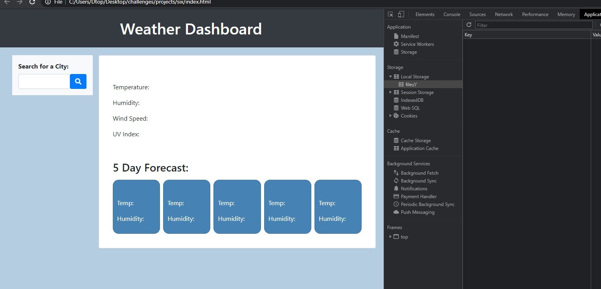
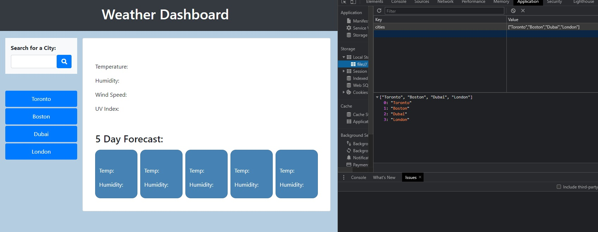
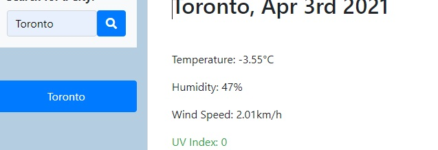
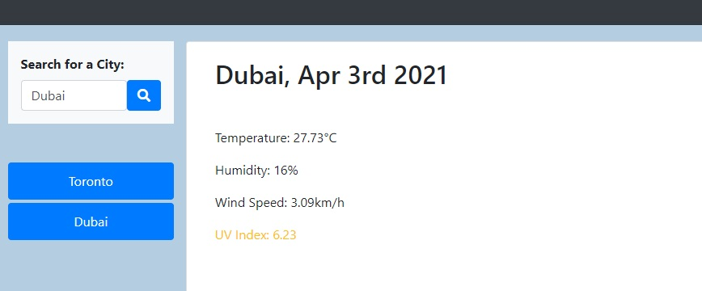
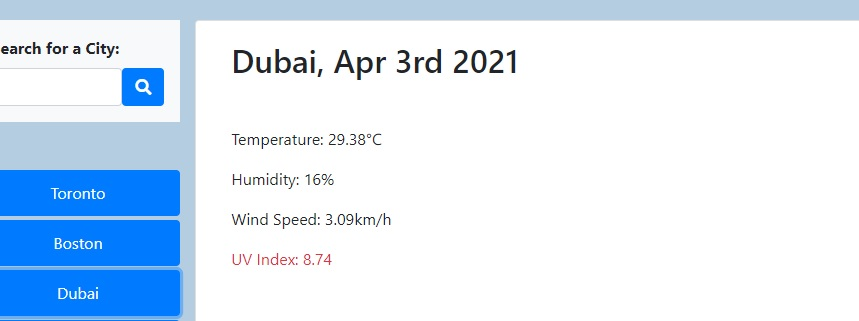

# six-weather-app

### [ Site Deployed Here](https://liaof.github.io/six-weather-app/)

## Project Summary

For this project I have created a Weather Dashboard that uses [OpenWeather API](https://openweathermap.org/api) to take an city name and fetches it's co-ordinates, which is then used as parameters to fetch a different OpenWeather API that returns the weather forecast. This data is then displayed in the appropriate page elements.

After the content is fetched and displayed on the webpage, the search term is saved in localStorage and a button is created that upon triggering, re-searches the corresponding city.

If a search is triggered by clicking one of the history buttons, that search term is not logged and no new btn elements are created. Basically, each search term can be logged once, preventing clutter.

### Screenshots

With a clear localStorage  
 
  
After a few searches and a page refresh  

  
UV color coding  
 
 
 

### Resources Used
OpenWeather API 
FontAwesome 
JQuery 
Bootstrap 
Momentjs 
[www.w3schools](https://www.w3schools.com/) 
[This blogpost concerning localStorage](https://blog.logrocket.com/localstorage-javascript-complete-guide/)
